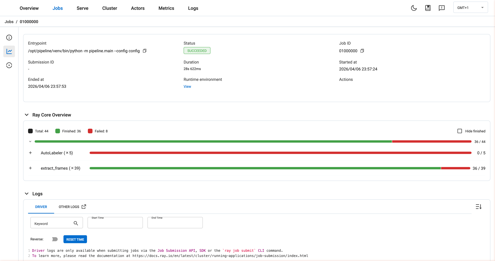
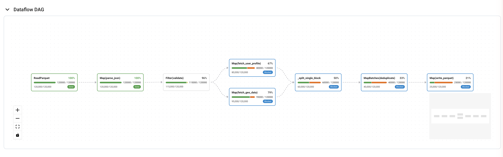
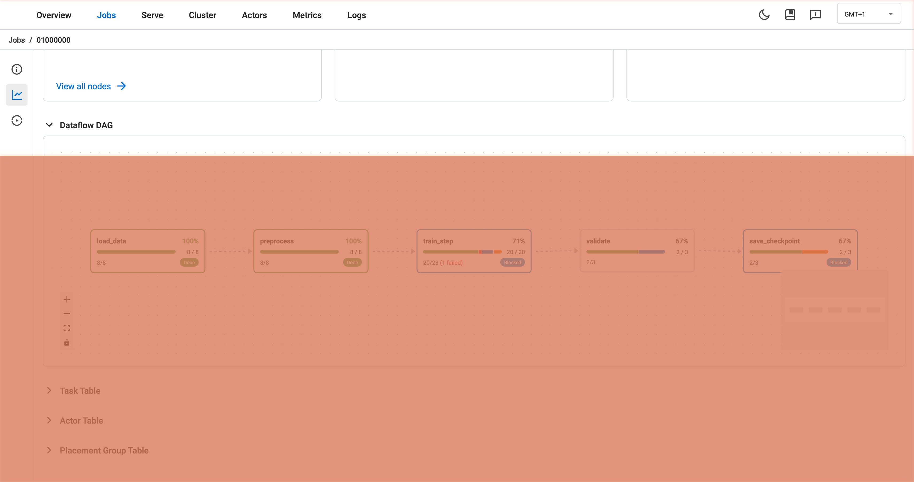
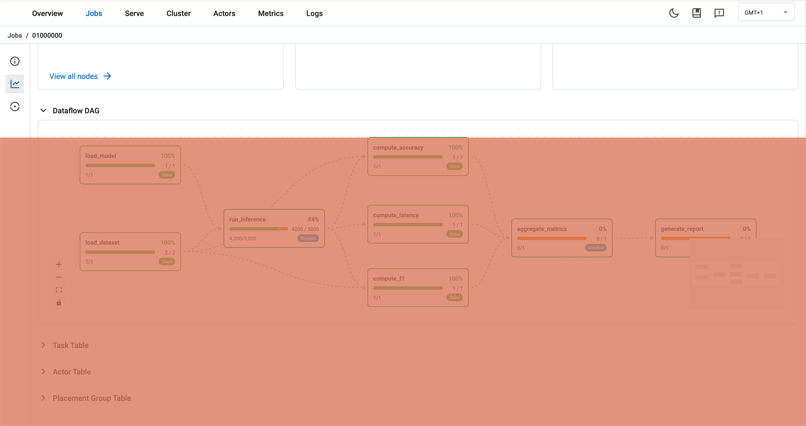
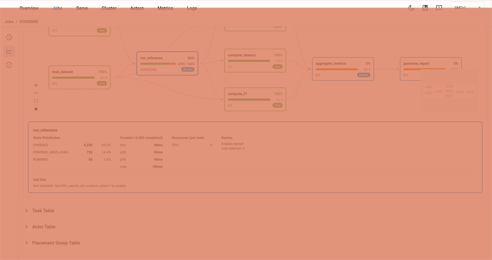

# [RFC][Dashboard] Dataflow DAG View for Job Detail Page

## Problem

The Ray Dashboard Job Detail page currently provides two ways to view task progress:

1. **Task Table** -- A flat list of individual tasks. With tens of thousands of tasks, it's nearly impossible to understand the overall pipeline structure or identify bottlenecks.

2. **Ray Core Overview (lineage tree)** -- Groups tasks by `parent_task_id` into a tree. However, `parent_task_id` represents "who submitted this task," NOT "whose output feeds into this task." When a driver submits all tasks, they all appear as flat children of the driver:

```python
@ray.remote
def driver():
    a = read.remote()           # parent = driver
    b = preprocess.remote(a)    # parent = driver (NOT read!)
    c = train.remote(b)         # parent = driver (NOT preprocess!)
```

```
# Current lineage tree -- no edges between stages
driver
├── [GROUP: read]         (x50000)  ████████████ 50K/50K
├── [GROUP: preprocess]   (x50000)  ████████░░░  36K/50K
└── [GROUP: train_batch]  (x5000)   ███░░░░░░░░  1.5K/5K
```

Users cannot see the actual dataflow relationships (read -> preprocess -> train) or quickly identify which stage is the bottleneck.



### Specific pain points

- **Finding bottlenecks**: Need to manually filter Task Table by function name, count states for each group, then mentally reconstruct the pipeline order. Takes 10-15 minutes.
- **Understanding job structure**: New team members looking at a flat task table with 50K rows have no idea what the pipeline does.
- **Diagnosing failures**: When tasks fail, it's hard to tell if failures are root causes or cascading from upstream. The flat table doesn't show causality.
- **Detecting backpressure**: No way to visually compare completion ratios across pipeline stages to spot where data is piling up.

### User stories

| # | Role | Problem | Today | With DAG |
|---|------|---------|-------|----------|
| 1 | New team member | Understand job structure | Read source code 30min+ | 2 seconds looking at DAG |
| 2 | Data Engineer | Find bottleneck | 15 min manual filter + counting | 5 sec, look at node colors |
| 3 | ML Engineer | Find failure root cause | 20 min reading error logs | See upstream direction + red nodes |
| 4 | Data Engineer | Detect backpressure | Add logging, re-run | See completion ratio waterfall |
| 5 | MLOps | Decide if GPUs are enough | Cross-reference Task + Actor tables | See PENDING_NODE_ASSIGNMENT on node |
| 6 | Anyone | Understand fan-out/fan-in | Read source code | See DAG shape |
| 7 | SRE | Assess failure blast radius | Trace code dependencies | See downstream nodes turn blue |
| 8 | Tech Lead | Explain delay to PM | Draw diagram manually 30min | Screenshot DAG directly |

## Proposal

Add a **Dataflow DAG** view to the Job Detail page that visualizes task groups and their ObjectRef dependencies as a directed acyclic graph.

### How it works

1. **Group tasks by name** -- Use `task.name` (or `func_or_class_name` for Ray Core tasks) as the grouping key. Each unique name becomes a DAG node.
2. **Derive edges from ObjectRef dependencies** -- Each task's input ObjectRefs (pass-by-ref args) point to objects produced by other tasks. By mapping `return_object_id -> producer_name` and `dependency_object_id -> consumer_name`, we get directed edges between task groups.
3. **Aggregate per-group statistics** -- For each node: state distribution (finished/running/failed/pending), count, completion percentage.
4. **Render as interactive DAG** -- Left-to-right layout with progress bars, color-coded bottleneck detection, and click-to-expand detail panels.

### Example: Ray Data ETL Pipeline



### Example: Ray Core Training Pipeline



### Example: Evaluation Pipeline



### Bottleneck detection

Each node is color-coded based on its state relative to upstream nodes:

| Color | Condition | Meaning |
|-------|-----------|---------|
| Green | 100% finished | Done |
| Yellow | All upstream done but this node has >50% pending | Bottleneck / slow |
| Red | >5% failure rate | Failing |
| Blue | All pending tasks are PENDING_ARGS_AVAIL | Blocked on upstream |
| Gray | Default | Healthy / in progress |

### Click-to-expand detail panel



Clicking a node shows:
- **State Distribution** -- Count and percentage for each task state
- **Duration** -- min / p50 / p95 / max from `start_time_ms` and `end_time_ms`
- **Resources** -- Per-task resource requirements from `required_resources` (e.g., CPU: 1, GPU: 1)
- **Retries** -- Number of retried tasks and max attempt number from `attempt_number`
- **Call Site** -- Source code location from `call_site` (requires `RAY_record_ref_creation_sites=1`)

## Design Principles

1. **Complement, don't replace** -- The Dataflow DAG is a new collapsible section alongside the existing lineage tree, Task Table, and Actor Table. Each view answers a different question: lineage = "who spawned whom," DAG = "how data flows," Task Table = individual task details.

2. **Consistent UI pattern** -- Uses the same `CollapsibleSection` pattern as Task Table and Actor Table. Users don't need to learn a new interaction model.

3. **Lazy loading** -- DAG data is only fetched when the section is expanded, avoiding unnecessary API calls.

4. **Graceful degradation** -- For workloads without ObjectRef dependencies (e.g., Ray Tune's independent trials), the DAG simply shows isolated nodes with no edges. It doesn't break; it just provides less value. The lineage tree remains available for those cases.

5. **Aggregate, not enumerate** -- The DAG groups thousands of tasks into ~5-20 nodes by function name. Individual task details are accessible via the click-to-expand panel and the existing Task Table. This keeps the DAG readable regardless of task count.

6. **Use real task names** -- Ray Data operators all share `func_or_class_name = "_map_task"`, but each has a distinct `name` field (`ReadParquet`, `Map(parse_json)`, etc.). The aggregation uses `task.name || task.func_or_class_name` to get meaningful node labels.

7. **Minimal backend footprint** -- Only 2 new protobuf fields and ~10 lines of C++. The ObjectRef dependency data already exists in `TaskSpec`; we just expose it through the existing task event pipeline.

```
Job Detail page layout:

Ray Core Overview          ← Existing summary progress bar (always visible)
│
├── ▼ Dataflow DAG         ← NEW, collapsible
├── ▶ Task Lineage         ← Existing AdvancedProgressBar, collapsible
├── ▶ Task Table           ← Existing, collapsible
├── ▶ Actor Table          ← Existing, collapsible
└── ▶ Placement Group Table ← Existing, collapsible
```

## Required Changes

### Backend (small)

**1. Protobuf: Add 2 fields to `TaskInfoEntry`** (~5 lines)

```protobuf
// src/ray/protobuf/common.proto
message TaskInfoEntry {
  // ... existing fields ...
  repeated bytes dependency_object_ids = 30;  // ObjectIDs this task consumes
  repeated bytes return_object_ids = 31;      // ObjectIDs this task produces
}
```

**2. C++: Populate fields in `FillTaskInfo()`** (~10 lines)

```cpp
// src/ray/common/protobuf_utils.cc
// Uses existing GetDependencyIds() and ReturnId() methods
for (const auto &dep_id : task_spec.GetDependencyIds()) {
  task_info->add_dependency_object_ids(dep_id.Binary());
}
for (size_t i = 0; i < task_spec.NumReturns(); i++) {
  task_info->add_return_object_ids(task_spec.ReturnId(i).Binary());
}
```

**3. Python State API: Expose new fields + add `summary_by=dataflow`** (~150 lines)

- Add `dependency_object_ids` and `return_object_ids` to `TaskState`
- Add `to_summary_by_dataflow()` aggregation method on `TaskSummaries`
- Accept `summary_by=dataflow` in the `/api/v0/tasks/summarize` endpoint

The aggregation logic:
1. Build `object_id -> producer_name` mapping from `return_object_ids`
2. Build edges from `dependency_object_ids -> producer` lookups
3. Group tasks by name with state counts
4. Topological sort nodes by edges

### Frontend (new component)

**Library choice: ReactFlow + dagre**

The Ray Dashboard currently has zero visualization dependencies — all UI is MUI Table + CSS flexbox. We evaluated several options for DAG rendering:

| Option | Bundle Size | Pros | Cons |
|--------|------------|------|------|
| **ReactFlow + dagre** | ~150KB gzipped | React-first, custom nodes via JSX, built-in zoom/pan/minimap, large community | First viz dependency added to dashboard |
| Pure SVG + dagre | ~30KB | Lightweight, full control | Must hand-build zoom/pan, edge routing, touch support, drag, minimap |
| D3 | ~80KB | Powerful, flexible | Fights React for DOM control, steep learning curve |
| Visx (Airbnb) | ~20KB per module | Lightweight React D3 wrappers | Too low-level, essentially building from scratch |
| Cytoscape.js | ~200KB | Full-featured graph lib | Designed for network graphs, not DAGs; no React integration |

**Why ReactFlow**: Complex DAGs (Ray Data pipelines can have 10+ operators with fan-out/fan-in) need zoom/pan, edge routing that avoids crossing nodes, and a minimap for navigation. Building these from scratch with pure SVG is significant effort and error-prone (touch support, resize reflow, accessibility). ReactFlow provides all of this out of the box, and its custom node API lets us embed MUI components (`Paper`, `MiniTaskProgressBar`) directly — so DAG nodes look consistent with the rest of the dashboard.

**dagre** handles the layout algorithm (topological sort + layered positioning), ReactFlow handles rendering and interaction.

**Implementation:**
- New `DAGProgressBar` component using ReactFlow for rendering and dagre for layout
- Each node is a custom ReactFlow node containing the existing `MiniTaskProgressBar`
- Collapsible section on Job Detail page (same pattern as Task Table, Actor Table)
- Click-to-expand detail panel below DAG

## Workload Applicability

Verified by running real Ray workloads and inspecting the task State API:

| Workload | DAG Quality | Notes |
|----------|-------------|-------|
| **Ray Data** | Excellent | Operators appear as separate task names: `ReadParquet`, `Map(fn)`, `Filter(fn)`, `MapBatches(fn)`. Clear pipeline structure with edges. |
| **Ray Core** | Excellent | `@ray.remote` function names map directly to DAG nodes. ObjectRef dependencies create natural edges. |
| **Ray Train** | Moderate | Training loop creates a linear pipeline. More useful when combined with Ray Data for data loading. |
| **Ray Serve** | Not applicable | Request handling uses long-lived actor replicas. Actor method calls don't appear in task State API summary. |
| **Ray Tune** | Limited | Independent trials produce nodes with no edges. DAG degrades to a single flat node. |

Key finding: Ray Data uses `func_or_class_name = "_map_task"` for ALL operators, but the **`name` field** has the real operator name (e.g., `ReadRange`, `Map(parse_json)`). The aggregation uses `task.name || task.func_or_class_name` as the grouping key.

## Alternatives Considered

1. **Enhance the existing lineage tree** -- Could add ObjectRef-based edges to the lineage view. But trees and DAGs are fundamentally different data structures; the lineage tree would need major rework to support cycles in layout (fan-in patterns).

2. **Pure frontend with no backend changes** -- Could build a grouped progress view without edges (just nodes sorted by first start time). Useful but misses the key value: showing data flow relationships.

3. **Use Spark-style static DAG** -- Ray's DAG is dynamic (tasks spawn at runtime). We aggregate by name to get a stable graph that updates incrementally.

## Performance Considerations

- **ObjectRef tracking overhead**: `GetDependencyIds()` already exists in C++ and is O(num_args). Typical tasks have 1-5 args. Extra bytes per TaskEvent: ~84 bytes (3 ObjectIDs x 28 bytes).
- **Memory for 1M tasks**: ~84MB additional for ObjectRef fields. Acceptable.
- **Frontend**: dagre layout is <50ms for 10 nodes. ReactFlow handles zoom/pan efficiently.
- **API**: The `summary_by=dataflow` endpoint aggregates at the group level, returning ~5-20 nodes regardless of total task count.

## Known Limitations

### `ray.get()` breaks the ObjectRef chain

The most significant limitation. Many users write Ray code with `ray.get()` between every step:

```python
# Common pattern — breaks DAG edges
data = ray.get(load_data.remote())           # ObjectRef resolved here
processed = ray.get(preprocess.remote(data))  # 'data' is a value, not ObjectRef
result = ray.get(train.remote(processed))     # same — no dependency_object_ids

# DAG result: 3 disconnected nodes, no edges ❌
```

Only when ObjectRefs are passed directly do edges appear:

```python
# Correct pattern — preserves DAG edges
data_ref = load_data.remote()
processed_ref = preprocess.remote(data_ref)    # ObjectRef passed directly
result = ray.get(train.remote(processed_ref))

# DAG result: load_data → preprocess → train ✅
```

**Impact**: Ray Core users who `ray.get()` at every step will see nodes with no edges. However:
- **Ray Data is not affected** — operators pass ObjectRefs internally through the streaming executor, never resolving in the driver.
- **Best practice alignment** — unnecessary `ray.get()` blocks the driver and hurts performance. The DAG view provides a visual incentive to follow the recommended pattern.
- **Graceful degradation** — nodes without edges still show useful per-group progress (state counts, completion %). It's equivalent to the existing `summary_by=func_name` view but with individual node cards.

### Lambda name collisions

```python
ds = ds.map(lambda x: x * 2)   # name = "Map(<lambda>)"
ds = ds.map(lambda x: x + 1)   # name = "Map(<lambda>)" — same name, merged into one node
```

When Ray Data users pass lambdas, multiple distinct operators can share the same `name`. They get merged into a single DAG node. **Mitigation**: users can pass named functions or use `fn_constructor_kwargs` to get distinct names. This is also a known limitation of Ray Data's own progress bar.

### `ray.put()` objects have no producer task

```python
config = ray.put({"lr": 0.01})           # put by driver, not a task
results = [train.remote(config) for _ in range(10)]
# train's dependency_object_ids includes config's ObjectID
# but no producer task exists → edge is silently dropped
```

This is acceptable — `ray.put()` objects are typically config/metadata, not pipeline stages.

### Ray Data operator fusion

Ray Data may fuse multiple operators into a single task with a combined name like `ReadRange->Map(<lambda>)->Filter(<lambda>)`. The DAG structure depends on fusion decisions, which can vary based on resource configuration. This is an inherent property of Ray Data's execution model, not something the DAG view can control.

## Working Prototype

A fully functional prototype is available for review and testing:

**Branch**: [`claude/goofy-aryabhata`](https://github.com/tobby168/ray/tree/claude/goofy-aryabhata)

**What's included**:
- Protobuf + C++ changes (`TaskInfoEntry` + `FillTaskInfo()`)
- Python aggregation logic (`to_summary_by_dataflow()` with topological sort)
- ReactFlow + dagre frontend component with bottleneck detection and detail panel
- Mock data for 3 workload scenarios (Ray Data ETL, training, eval)
- Python unit tests (pipeline, fan-out/fan-in, no-dependency patterns)

**How to test** (frontend with mock data, no backend build required):
```bash
cd python/ray/dashboard/client
npm install
PORT=3001 npm start
# Open http://localhost:3001/#/jobs/<any-real-job-id>
# Add ?dag=data-pipeline or ?dag=training or ?dag=eval to switch scenarios
```
